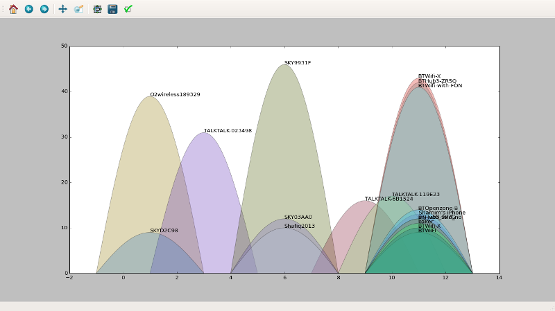

wifi-channels
=============

A simple python script for viewing local wifi channel usage vs. signal strength.
Draws an almost pretty graph.

depends
=======

+ [Wifi tools for python](https://pypi.python.org/pypi/wifi)
+ [matplotlib](https://pypi.python.org/pypi/matplotlib)

usage
=====

./wifi-channels.py <interface>

Needs root access really, otherwise you can only see the ssid you're
connected to...

The x-axis is the channel.  The y-axis indicates signal strength (it's 100 +
the dBm to be precise.)

screenshot
==========

The almost pretty graph looks like this.

